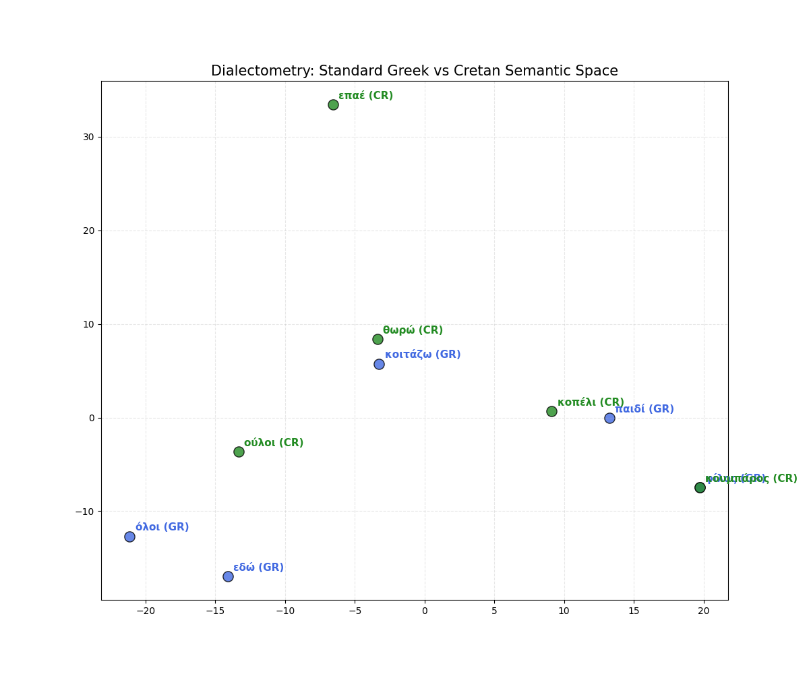

# Computational Social Dynamics: An Algorithmic Study

### 🔭 Overview
This repository contains a collection of **Agent-Based Models** and **Simulations** exploring the emergent properties of complex social systems. Using Python and Graph Theory, I investigate how simple algorithmic rules can lead to profound macroscopic phenomena like polarization, inequality, and information entropy.

---

### 📂 Projects

#### 1. Algorithmic Fairness (The Glass Ceiling)
* **Directory:** `1_algorithmic_fairness/`
* **Model:** NetworkX Graph Theory & Spatial Matching
* **Hypothesis:** How "efficient" hiring algorithms create topological barriers to social mobility.
* **Key Finding:** Strict matching criteria create disconnected graph components, mathematically proving the "Experience Trap".

#### 2. Social Dynamics (Thermodynamics of Polarization)
* **Directory:** `2_social_dynamics/`
* **Model:** Deffuant (Bounded Confidence Model)
* **Hypothesis:** How limited tolerance ("energy") leads to inevitable social fragmentation.
* **Key Finding:** Identified the critical threshold (0.30) where society transitions from consensus to sectarianism.

#### 3. Semantic Geometry (Dialects & Bias)
* **Directory:** `3_semantic_geometry/`
* **Model:** NLP & Vector Space Mapping
* **Hypothesis:** Mapping linguistic divergence and bias in geometric space.
* **Visualization:**
> *Cretan Dialect Map visualization generated from the analysis:*
> 

#### 4. AI Safety (Model Collapse)
* **Directory:** `4_ai_safety/`
* **Model:** Recursive Gaussian Training
* **Hypothesis:** The entropic decay of information when AI models train on AI-generated data.
* **Key Finding:** Demonstrated variance collapse within 10 generations, highlighting the necessity of human interaction for system stability.

---

### 🛠️ Tech Stack
* **Core:** Python 3.10+
* **Simulation:** NumPy, SciPy
* **Network Science:** NetworkX
* **Visualization:** Matplotlib, Seaborn

### 🚀 How to Run
1. Install dependencies:
   pip install -r requirements.txt
2. Run the polarization simulation:
   python 2_social_dynamics/polarization.py
3. Run the glass ceiling model:
   python 1_algorithmic_fairness/glass_ceiling.py